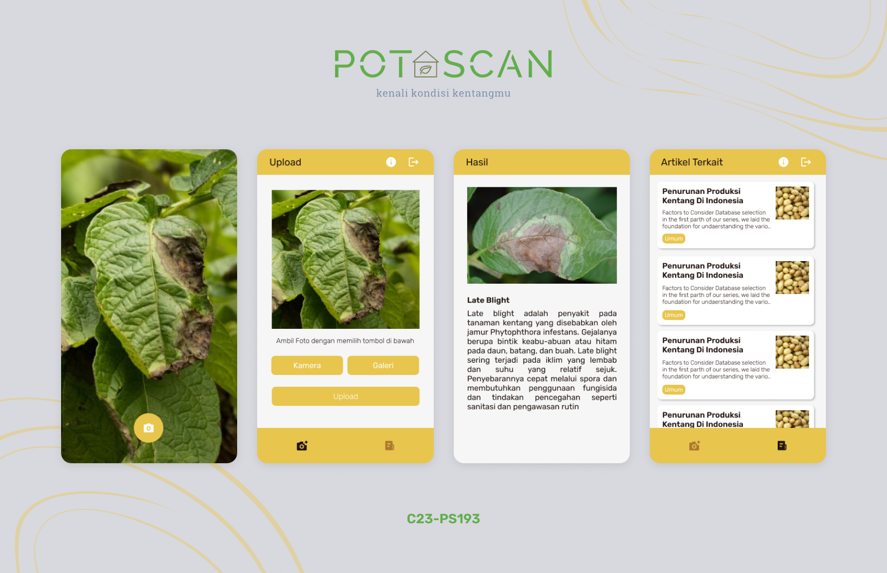

# PotaScan (Potato Scan App)
## Introduction

PotaScan is an application that utilizes image processing technology and artificial intelligence to identify diseases in potato plants. Its primary objective is to enhance potato plant productivity and ensure a consistent food supply for the local community.
[Here is the app design's link](https://www.figma.com/file/Zxc0odNwsaDOR3RhiOawZZ/PotaScan?type=design&node-id=18-23&t=JJUO4q8ABKbUa34F-0)

## Features
- Authentication (login and register)
- Image classification: identify potato leaf disease from the image that have been taken or selected
- Articles: resources for cultivating potato plants, reading material can provide valuable information and guidance.

## Libraries
- [Lifecycle](https://developer.android.com/jetpack/androidx/releases/lifecycle?hl=id)
- [Navigation](https://developer.android.com/jetpack/androidx/releases/navigation?hl=id)
- [Glide](https://bumptech.github.io/glide/)
- [Preference Datastore](https://developer.android.com/codelabs/android-preferences-datastore?hl=id#0)
- [Retrofit](https://square.github.io/retrofit/)
- [OkHttp3](https://square.github.io/okhttp/) 
- [CameraX](https://developer.android.com/jetpack/androidx/releases/camera?hl=id)